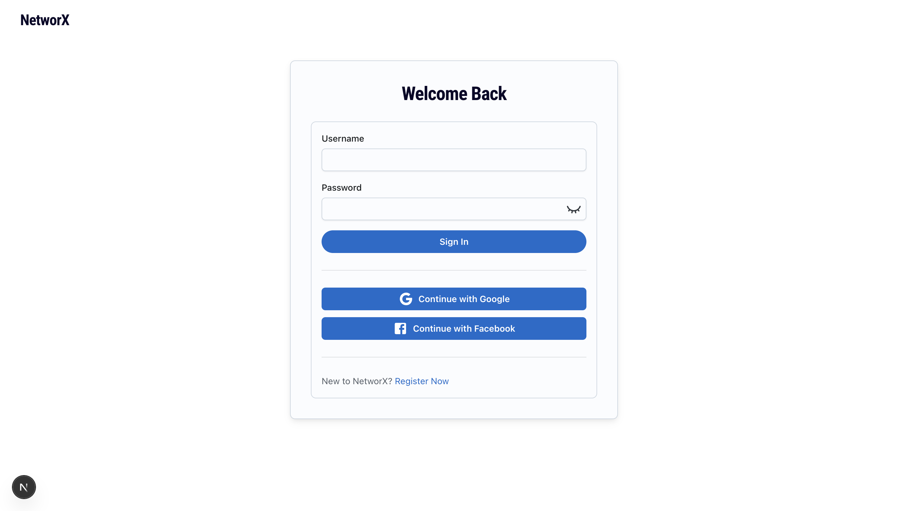
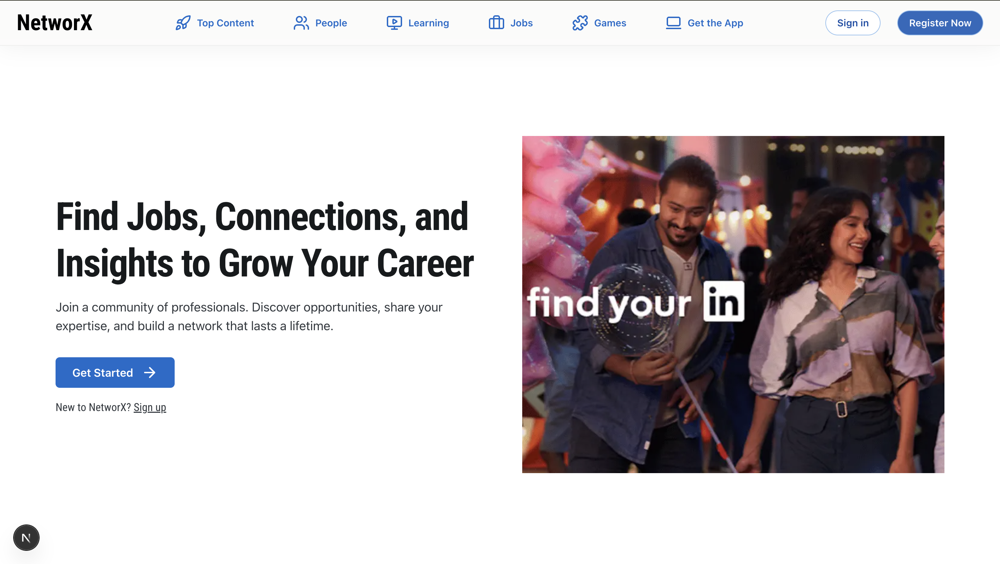
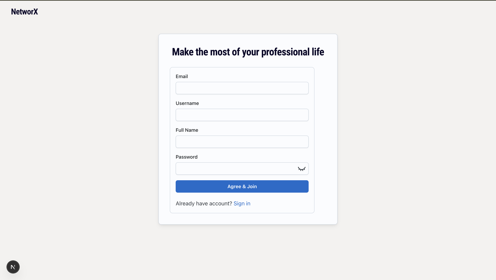

## NetworX

NetworX is a social networking application built to explore real-world backend and full-stack concepts such as users, connections, posts, messaging, and conversations.

This repository includes the database schema backup required to run the project locally.

## 📦 Tech Stack

**Backend**: Node.js / Express

**Database**: PostgreSQL

**Frontend**: React / Next.js

**Auth**: Sessions / JWT

**Microservice**: Java Spring Boot

**Caching\***: Redis

## 📸 Application Screenshots

### 🔐 Login 
Secure login system for users before accessing the portal.



---

### 🏠 Landing Page
Clean and minimal landing page.



---

### 💬 SignUp
Users enter details to create an account on the portal.




## Redis (Caching, Realtime Signals, Feed Acceleration)

From 2 Feb 2026 onwards, Redis is used in NetworX as a high-speed, in-memory layer to reduce PostgreSQL load, accelerate feed reads, and power short-lived realtime signals without writing transient state to the database.

**Why Redis here?**

- Feed generation is read-heavy and expensive to recompute (connections → posts → enrichment → pagination)

- Profile and connection data are reused across many APIs

- Realtime UX (e.g., typing indicators) should not touch the DB

- Like counts are frequently read, rarely changed

**What we cache**
| Use Case | Key Pattern | TTL | Purpose |
| ---------------- | -------------------------------------------------|----------- | ------------------------------------------------------------------ |
| Feed cache | `feed:connections:{user_id}:{limit}:{offset}` | 15 mins | Cache fully enriched paginated feed (fan-out on read optimization) |
| User profile | `profile:{user_id}` | 5–10 min | Avoid repeated profile lookups during feed/comment rendering |
| Profile About | `profile:about:{user_id}` | 15 min | Reused for profile viewing |
| Profile Education |`profile:edu:{user_id}` | 15 min |Reused for profile viewing |
| Profile Work | `profile:work:{user_id}` | 15 min | Reused for profile viewing |
| Jobs | `jobs:{user_id}:{limit}:{offset}` | 15 min | Reused for profile viewing |

**Performance Benchmarks**

**_Before Redis (No Cache)_**

- First Request: ~500ms
- Subsequent Requests: ~500ms
- DB Queries per Request: 2-3
- Microservice Calls: 1 per request

**_After Redis (With Cache)_**

- First Request (Cache Miss): ~500ms
- Cached Requests (Cache Hit): ~20ms ⚡
- DB Queries per Request: 0 (when cached)
- Microservice Calls: 0 (when cached)
- Performance Improvement: ~25x faster

**_Cache Hit Rate Optimization_**
To maximize cache hit rate:

- Use consistent pagination: Encourage users to use standard limit values (10, 20, 50)
- Monitor cache stats: Track hit/miss ratios
- Adjust TTL: Balance freshness vs performance
- Pre-warm cache: Cache feeds for active users during off-peak hours

## Video Streaming using FFmpeg

This project uses **FFmpeg** to enable efficient video streaming by converting uploaded video files into smaller chunks and generating an **HLS (HTTP Live Streaming)** playlist (`.m3u8`).

Instead of serving a full video file at once, the video is streamed **segment by segment**, similar to how platforms like YouTube, Hotstar, and Netflix deliver video content.

---

### Why FFmpeg + HLS?

- **Adaptive streaming**: Videos are split into small `.ts` segments, allowing smooth playback even on low or unstable networks.
- **Faster start time**: Playback can begin before the entire video is downloaded.
- **Seek support**: Users can jump forward/backward without loading the full file.
- **Scalability**: Ideal for large video libraries and high traffic.

---

### How It Works

1. A video is uploaded to the server.
2. FFmpeg converts the video into:
   - Multiple `.ts` chunk files
   - A single `.m3u8` playlist file
3. The client video player loads the `.m3u8` file.
4. Video chunks are fetched and played sequentially.

---

### FFmpeg Command Used

```bash
ffmpeg -i input.mp4 \
  -profile:v baseline \
  -level 3.0 \
  -start_number 0 \
  -hls_time 5 \
  -hls_list_size 0 \
  -f hls index.m3u8
```

## 🗄️ Database Setup

The project ships with a PostgreSQL SQL file that defines the **entire database structure** required for the application to run.

### What the SQL file contains

- Tables

- Columns and data types

- Primary keys & foreign keys

- Indexes

- Sequences

- Triggers and functions

> ⚠️ The file may also contain demo/sample data.
> This is intentional for development convenience.

## 🚀 Getting Started (Local Setup)

### 1️⃣ Create a PostgreSQL database

CREATE DATABASE NetworX;

### 2️⃣ Restore the database schema

- Using psql:

psql -U postgres -d NetworX -f NetworX_schema.sql

- Or using pgAdmin:

Create an empty database named NetworX

Right-click the database → Restore

Select NetworX_schema.sql

- Restore

### 3️⃣ Configure environment variables

Create a .env file in the backend root:

- DB_HOST=localhost
- DB_PORT=5432
- DB_NAME=NetworX
- DB_USER=postgres
- DB_PASSWORD=your_password

### 4️⃣ Run the backend

npm install
npm run dev

## 📊 Database Structure Overview

Key tables include:

- users – user profiles and authentication data

- posts – user posts

- comments – post comments

- connections – accepted user connections

- connection_requests – pending connection requests

- messages – chat messages

- conversations – user conversations

- education – education details

- jobs – job / experience details

- session – session tracking


## 🧠 Notes for Contributors

The database schema is version-controlled via SQL, not migrations.

If you modify the schema, regenerate the SQL backup before committing.

For production setups, consider splitting:

- schema.sql

- seed.sql

**_All the specification is mentioned here in NetworX repo, that does not mean this is the final repo. Backend and Microservice has there dedicated repo which I have mentioned above, clone that too for the working of this project. Merging of this whole project will be done after its completeion only._**

## 📜 License

This project is for educational and learning purposes.

## 🙌 Acknowledgements

Inspired by real-world social networking platforms to practice scalable backend and database design.

```

```
